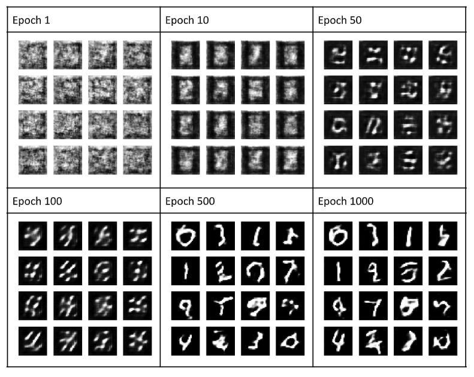

# ScribeGAN
A Deep Convolutional Generative Adversarial Neural Network to Generate Realistic Handwritten Digits 

#### Implementaion
Keras with Tensorflow backend

#### Dataset
MNIST dataset of handwritten digits (0-9). The dataset has 60,000 images for training and 10,000 for testing.

## Training
Training has 2 phases:
1. I first train the Discriminator model with real and fake images. The real images are drawn randomly from the MNIST dataset and given a label of 1. The fake images are created
using the generator by giving it a random noise input vector. The fake images are given a label of 0. This way the discriminator learns to distinguish between real and fake images.

2. After that, the Generator is trained through the Adversarial model. During this second training phase, the weights of the Discriminator are frozen. An image is generated by the
generator using random noise as input. The generated image is given to the discriminator which calculates the loss between it and a real image. This loss is backpropogated to tune the
parameters of the generator.

## Results
It took 6.78 minutes to train the DCGAN model for 1000 epochs on an online Tesla K80 GPU.
After 1000 epochs, the generator model started creating decent looking images of handwritten digits.

